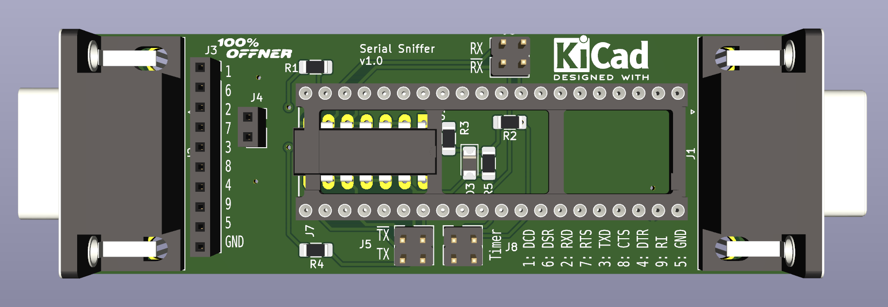

# SerialSniffer
A Board to to observe serial communication between two units.

Version 1.0

This is a small PCB with a STM32F401 "blackpill" Board ontop. It can measure the Baudrate with a timer and then switch to listen mode and relay the packets via USB to the host computer.

There are two hardware serial ports on the STM32 and one USB for shell and output.

Firmware is ChibiOS Link: https://www.chibios.org), Version is trunk from ChibiStudio 20. Compilation is done with ChibiStudio 20 on Linux.

### Usage ###

* Connect a USB Cable to the "blackpill" Board,
* Start a terminal (i use picocom - "picocom /dev/ttyACM0")
* press "ENTER" a shell prompt should appear: ch>
* enter "help" to get a list of all commands
* connect the Jumper J8 (marked "Timer") to one of the channels
* when communication occurs there should be a "Baud: abcd" outpt at the console
* enter the Baudrate with "sbr abcd" and switch on the listeners with "son 1"

There are some Jumpers on the board. To measure the Baudrate connect Jumper 

### Used Software and OS ###

* Linux Mint (21.3 cinnamon) (Link: https://linuxmint.com/)
* Sublime Text 3 (Link: https://www.sublimetext.com/)
* Chibi Studio 20 (IDE for ChibiOS) (Link: https://www.chibios.org/dokuwiki/doku.php?id=chibios:products:chibistudio:start)